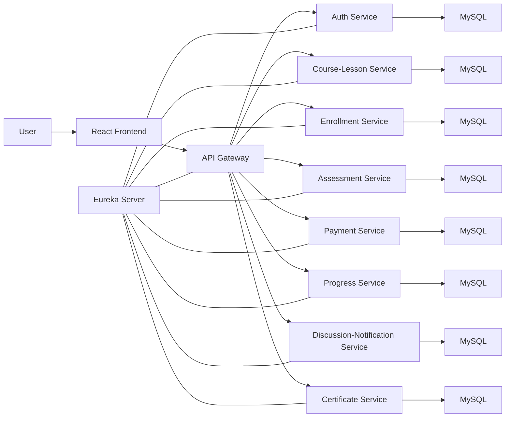

# EduLearn LMS

> A full-stack microservices-based Learning Management System built with Spring Boot, Spring REST, Spring Data JPA, MySQL, React, JWT authentication, Eureka, and API Gateway.

EduLearn is an online learning platform designed for three main user roles: `STUDENT`, `INSTRUCTOR`, and `ADMIN`.

The platform allows:

- students to register, log in, browse and enroll in courses, learn through lessons, track progress, and access certificates
- instructors to register, get approved by admin, and manage courses, lessons, and quizzes
- admins to manage users, approve instructors, review courses, monitor payments, moderate discussions, and manage certificates

---

## Table Of Contents

- [Project Overview](#project-overview)
- [Problem Statement](#problem-statement)
- [Objectives](#objectives)
- [Features](#features)
- [User Roles](#user-roles)
- [Tech Stack](#tech-stack)
- [Architecture](#architecture)
- [Microservices](#microservices)
- [Project Structure](#project-structure)
- [Service Ports](#service-ports)
- [Authentication Flow](#authentication-flow)
- [End-To-End Flow](#end-to-end-flow)
- [API Documentation](#api-documentation)
- [Database Configuration](#database-configuration)
- [Prerequisites](#prerequisites)
- [How To Run](#how-to-run)
- [Environment Variables](#environment-variables)
- [Testing](#testing)
- [Coding Standards And Design Choices](#coding-standards-and-design-choices)
- [Exception Handling](#exception-handling)
- [Current Testing Coverage](#current-testing-coverage)
- [Screenshots](#screenshots)
- [Future Improvements](#future-improvements)
- [Learning Outcomes](#learning-outcomes)
- [Author](#author)
- [License](#license)

---

## Project Overview

EduLearn is a distributed Learning Management System built to demonstrate:

- Spring Boot microservices architecture
- REST API-based frontend-backend communication
- role-based authentication and authorization
- domain-based service separation
- relational persistence using MySQL
- React-based single-page frontend
- unit testing in both backend and frontend

This project was developed as a complete academic and practical full-stack LMS implementation using:

- `Spring Boot`
- `Spring REST`
- `Microservices`
- `Spring Data JPA`
- `MySQL`
- `React`

---

## Problem Statement

Traditional classroom systems and many simple e-learning systems do not provide:

- centralized digital course access
- role-based platform governance
- scalable architecture
- modular maintenance
- automated enrollment and progress tracking
- integrated certificate and payment support

EduLearn addresses these issues by building a modular LMS where business capabilities are separated into dedicated services.

---

## Objectives

The main objectives of the project are:

- build a secure LMS platform for students, instructors, and admins
- support digital course creation and consumption
- implement role-based access using JWT authentication
- manage data through Spring Data JPA and MySQL
- separate business capabilities using microservices
- provide testable and maintainable backend and frontend code

---

## Features

### Core Features

- user registration and login
- JWT-based authentication
- role-based route protection
- instructor approval flow
- course creation and publishing workflow
- lesson and quiz management
- student enrollment
- progress tracking
- certificate support
- payments and subscriptions
- discussions and notifications
- Swagger API documentation

### Platform Features

- microservices-based architecture
- centralized routing through API Gateway
- optional service discovery through Eureka
- MySQL-backed persistence
- backend and frontend unit testing

---

## User Roles

### Student

- register and log in
- browse all courses
- view course details
- enroll in free or paid courses
- watch lessons
- attempt quizzes
- track learning progress
- access certificate-related features
- view notifications

### Instructor

- register as instructor
- wait for admin approval
- create and update courses
- manage lessons
- manage quizzes
- access instructor dashboard

### Admin

- approve instructors
- manage users
- review courses
- monitor payments and subscriptions
- manage certificates
- moderate discussions
- access admin dashboard

---

## Tech Stack

### Frontend

- React
- Vite
- React Router
- Axios
- Zustand
- Tailwind CSS
- React Hot Toast

### Backend

- Java 17
- Spring Boot
- Spring REST
- Spring Data JPA
- Spring Security
- JWT Authentication
- Spring Cloud Gateway
- Eureka Service Discovery

### Database

- MySQL

### Messaging / Infra

- RabbitMQ support
- Redis support
- SMTP support

Note:
Some optional infrastructure integrations are environment-controlled and can be disabled in local mode.

### Testing

- JUnit
- Mockito
- Vitest
- React Testing Library

### Documentation / Quality

- Swagger / SpringDoc OpenAPI
- SonarQube project configuration

---

## Architecture

EduLearn follows a microservices architecture where each service owns a focused business domain.

### High-Level Architecture



### Runtime Modes

This project supports two practical runtime modes:

- direct-service mode:
  frontend directly calls backend services by port
- gateway mode:
  frontend calls API Gateway and services are routed centrally

Direct-service mode is useful for local debugging.
Gateway mode is useful for full microservices architecture demonstration.

---

## Microservices

### 1. Auth Service

Responsible for:

- registration
- login
- JWT generation and validation
- profile management
- forgot/reset password
- instructor approval support
- admin bootstrap configuration

### 2. Course-Lesson Service

Responsible for:

- course creation
- course update
- course publishing
- course search and filtering
- lesson management

### 3. Enrollment Service

Responsible for:

- student enrollment
- enrollment validation
- enrollment status management
- course completion support

### 4. Assessment Service

Responsible for:

- quiz creation
- quiz management
- quiz retrieval and related assessment logic

### 5. Payment Service

Responsible for:

- payment record handling
- subscription handling
- refund-related flows
- revenue support APIs

### 6. Progress Service

Responsible for:

- progress tracking
- completion percentage support
- learning status updates

### 7. Discussion-Notification Service

Responsible for:

- platform discussions
- notifications
- moderation-related discussion support

### 8. Certificate Service

Responsible for:

- certificate lifecycle support
- certificate retrieval and verification-related behavior

### 9. API Gateway

Responsible for:

- centralized routing
- security filtering
- Swagger aggregation

### 10. Eureka Server

Responsible for:

- service registration
- service discovery

---

## Project Structure

```text
OnlineLearningManagementSystem-dev/
├── ai-service/
├── api-gateway/
├── assessment-service/
├── auth-service/
├── certificate-service/
├── course-lesson-service/
├── discussion-notification-service/
├── edulearn-frontend/
├── edulearn-web/
├── enrollment-service/
├── eureka-server/
├── payment-service/
├── progress-service/
├── CASE_STUDY.md
├── LD_PREP_GUIDE.md
├── LD_PREP_GUIDE_DETAILED.md
├── OLM_Internal_Working_Revision_Guide.pdf
├── sonar-project.properties
└── README.md
```

---

## Service Ports

| Service | Port |
|---|---:|
| Eureka Server | 8761 |
| API Gateway | 8765 |
| Auth Service | 8081 |
| Course-Lesson Service | 8082 |
| Enrollment Service | 8083 |
| Assessment Service | 8084 |
| Payment Service | 8085 |
| Progress Service | 8086 |
| Discussion-Notification Service | 8087 |
| Certificate Service | 8090 |
| Frontend | 5173 |

---

## Authentication Flow

EduLearn uses JWT-based authentication.

### Login Flow

1. user submits email and password from frontend
2. frontend calls `POST /auth/login`
3. `auth-service` validates credentials
4. JWT token is generated
5. token and user details are returned
6. frontend stores token in local storage and auth state
7. protected APIs use `Authorization: Bearer <token>`

### Registration Flow

1. user submits registration form
2. frontend calls `POST /auth/register`
3. `auth-service` validates email uniqueness and role rules
4. password is encoded
5. user is stored in MySQL

### Instructor Approval Rule

- instructors can register
- instructor login remains blocked until admin approval

---

## End-To-End Flow

### Student Flow

1. student opens the platform
2. student registers
3. student logs in
4. student browses courses
5. student opens course details
6. student enrolls in a course
7. student watches lessons
8. progress is updated
9. certificate flow becomes available after completion

### Internal Request Path Example: Registration

```text
RegisterPage.jsx
-> authApi.register()
-> POST /auth/register
-> AuthResource.register()
-> AuthServiceImpl.register()
-> UserRepository.save()
-> MySQL
```

### Internal Request Path Example: Login

```text
LoginPage.jsx
-> authApi.login()
-> POST /auth/login
-> AuthResource.login()
-> AuthServiceImpl.login()
-> JWT generated
-> token returned to frontend
```

---

## API Documentation

Swagger is available through the API Gateway when the related services are running.

### Swagger UI

- `http://localhost:8765/swagger-ui.html`

### Example Proxied Docs

- `http://localhost:8765/swagger/auth/v3/api-docs`
- `http://localhost:8765/swagger/course/v3/api-docs`
- `http://localhost:8765/swagger/enrollment/v3/api-docs`
- `http://localhost:8765/swagger/assessment/v3/api-docs`
- `http://localhost:8765/swagger/payment/v3/api-docs`
- `http://localhost:8765/swagger/progress/v3/api-docs`
- `http://localhost:8765/swagger/discnotif/v3/api-docs`
- `http://localhost:8765/swagger/certificate/v3/api-docs`

---

## Database Configuration

The project is configured to use MySQL.

### Default Local Setup

- username: `root`
- password: `aakash`

Some services support environment-driven DB values.

Example variables:

- `DB_URL`
- `DB_USERNAME`
- `DB_PASSWORD`
- `DB_DRIVER`
- `JPA_DIALECT`

Note:
Local configurations are set up for developer convenience. Before pushing publicly, consider removing sensitive defaults and using environment variables only.

---

## Prerequisites

Install the following before running the project:

- Java 17
- Maven 3.9+
- Node.js 22+
- npm 11+
- MySQL

Optional for extended features:

- Redis
- RabbitMQ
- SMTP mail server

---

## How To Run

### 1. Start MySQL

Make sure MySQL is running and accessible.

### 2. Start Eureka Server

```bash
cd eureka-server
mvn spring-boot:run
```

### 3. Start API Gateway

```bash
cd api-gateway
mvn spring-boot:run
```

### 4. Start Backend Services

```bash
cd auth-service
mvn spring-boot:run
```

```bash
cd course-lesson-service
mvn spring-boot:run
```

```bash
cd enrollment-service
mvn spring-boot:run
```

```bash
cd assessment-service
mvn spring-boot:run
```

```bash
cd payment-service
mvn spring-boot:run
```

```bash
cd progress-service
mvn spring-boot:run
```

```bash
cd discussion-notification-service
mvn spring-boot:run
```

```bash
cd certificate-service
mvn spring-boot:run
```

### 5. Start Frontend

```bash
cd edulearn-frontend
npm install
npm run dev
```

### Direct-Service Local Mode

For local development, the frontend can also connect directly to services by port through the configured Axios base URLs.

---

## Environment Variables

Common environment variables used in the project:

- `DB_URL`
- `DB_USERNAME`
- `DB_PASSWORD`
- `DB_DRIVER`
- `JPA_DIALECT`
- `JWT_SECRET`
- `JWT_EXPIRATION`
- `APP_MAIL_ENABLED`
- `MAIL_HOST`
- `MAIL_PORT`
- `MAIL_USERNAME`
- `MAIL_PASSWORD`
- `REDIS_HOST`
- `REDIS_PORT`
- `FRONTEND_BASE_URL`
- `GATEWAY_BASE_URL`
- `APP_BOOTSTRAP_ADMIN_ENABLED`
- `APP_BOOTSTRAP_ADMIN_FULL_NAME`
- `APP_BOOTSTRAP_ADMIN_EMAIL`
- `APP_BOOTSTRAP_ADMIN_PASSWORD`

### Current Admin Bootstrap Details

The auth service supports admin bootstrap configuration via `application.yml`.

Current configured admin identity:

- email: `aakashattri516@gmail.com`
- password: `12345678`

Note:
Do not keep real credentials in a public repository. For GitHub, prefer documenting the expected config format and removing real secrets from tracked files.

---

## Testing

### Backend Tests

Examples:

```bash
cd auth-service
mvn test
```

```bash
cd payment-service
mvn test
```

```bash
cd enrollment-service
mvn test
```

### Frontend Tests

```bash
cd edulearn-frontend
npm test -- --run
```

### Frontend Build Verification

```bash
cd edulearn-frontend
npm run build
```

---

## Coding Standards And Design Choices

This project follows layered backend architecture:

- controller / resource layer
- service layer
- repository layer
- entity layer
- exception layer
- config layer

### Naming Conventions

- classes use `PascalCase`
- methods use `camelCase`
- variables use meaningful business names
- endpoints are role- and resource-oriented

### Frontend Design Choices

- React functional components
- page separation by role
- protected route guards
- lazy-loaded routes
- reusable API helpers

### Backend Design Choices

- domain-based microservice separation
- business logic in service layer
- JPA repositories for persistence
- centralized exception handling

---

## Exception Handling

The backend uses centralized exception handling through `@ControllerAdvice`.

Typical cases handled include:

- duplicate user registration
- invalid credentials
- user not found
- unexpected internal errors

### Example HTTP Responses

- `409 CONFLICT`
- `401 UNAUTHORIZED`
- `404 NOT FOUND`
- `500 INTERNAL SERVER ERROR`

This improves:

- frontend error handling
- response consistency
- debugging and maintainability

---

## Current Testing Coverage

### Backend

Implemented unit testing currently covers:

- auth service logic
- payment service logic
- enrollment service logic

### Frontend

Implemented unit testing currently covers:

- home page rendering
- forgot password flow
- login flow
- registration flow

### Testing Tools

- backend:
  `JUnit`, `Mockito`
- frontend:
  `Vitest`, `React Testing Library`

---

## Screenshots

Add screenshots before or after pushing to GitHub.

Suggested screenshots:

- Home Page
- Login Page
- Register Page
- Student Dashboard
- Instructor Dashboard
- Admin Dashboard
- Swagger UI

Example section:

```md
## Screenshots

### Home Page


### Login Page

```

---

## Future Improvements

- stronger production-grade payment verification
- more integration and end-to-end tests
- unified API error response format across services
- improved accessibility for some frontend forms
- Docker / docker-compose deployment support
- CI/CD pipeline integration
- stronger cross-service DTO standardization

---

## Learning Outcomes

This project helped strengthen understanding of:

- Spring Boot microservices
- REST API design
- JWT authentication
- Spring Data JPA with MySQL
- frontend-backend integration using React and Axios
- service discovery and gateway routing
- backend and frontend unit testing
- role-based software design

---

## Author

**Aakash Attri**

You can add:

- GitHub profile
- LinkedIn profile
- email

Example:

- GitHub: `https://github.com/your-username`
- LinkedIn: `https://linkedin.com/in/your-profile`

---

## License

This project is intended for academic, learning, and portfolio purposes.
